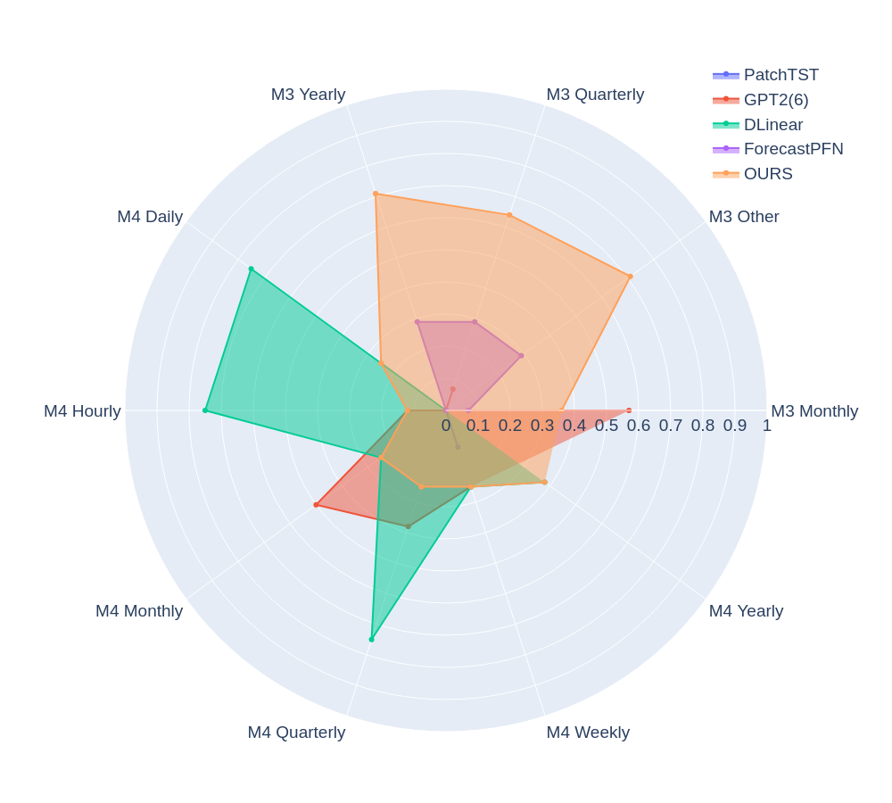

Here's a revised version of your README:

---

# Towards Foundation Time Series Models: To Synthesize or Not to Synthesize?

**REPO IN PROGRESS**

**Authors**: Kseniia Kuvshinova, Olga Tsymboi, Alina Kostromina, Dmitry Simakov, Elizaveta Kovtun

This repository accompanies the paper, *"Towards Foundation Time Series Models: To Synthesize or Not to Synthesize?"*. 

In industries where forecasting large volumes of time series is common, training a separate model for each series is often impractical. Instead, a foundation model that operates effectively in zero-shot or few-shot scenarios is a promising solution. However, a critical question arises: what should be used as the training dataset for such a model?

Drawing inspiration from advancements in NLP, where synthetic data has enhanced dataset quality, this work explores whether training foundation time series models on synthetic data is advantageous compared to using only real-life examples. Unlike natural language, generating synthetic time series data offers greater control over series patterns, time horizons, and sample sizes.

Our experiments, focused on regular time series data, suggest that using only real-life data yields better performance. The choice of authentic dataset significantly impacts inference results. Nevertheless, even with limited short time series data, transitioning from a zero-shot setting to supervised training can substantially improve model performance.

<div align="center"></div>

## Getting Started

1. Follow the instructions in the respective task and model folders.

## Citation

If you find this repository useful, please cite our paper.

```
@article{kuvshinova2024towards,
  title={Towards Foundation Time Series Model: To Synthesize Or Not To Synthesize?},
  author={Kuvshinova, Kseniia and Tsymboi, Olga and Kostromina, Alina and Simakov, Dmitry and Kovtun, Elizaveta},
  journal={arXiv preprint arXiv:2403.02534},
  year={2024}
}
```

---

Let me know if you need any more adjustments!
